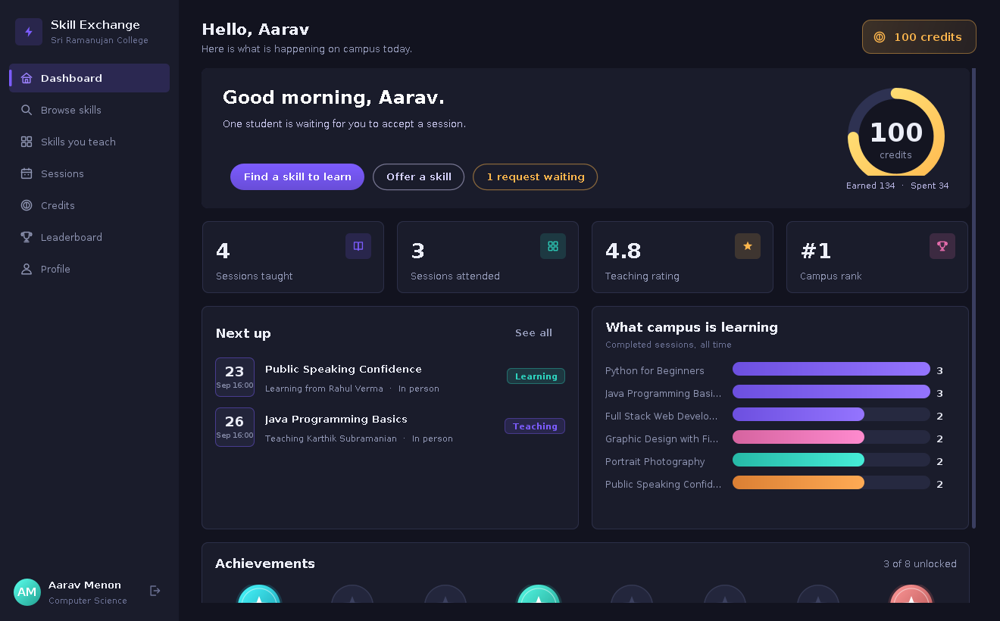
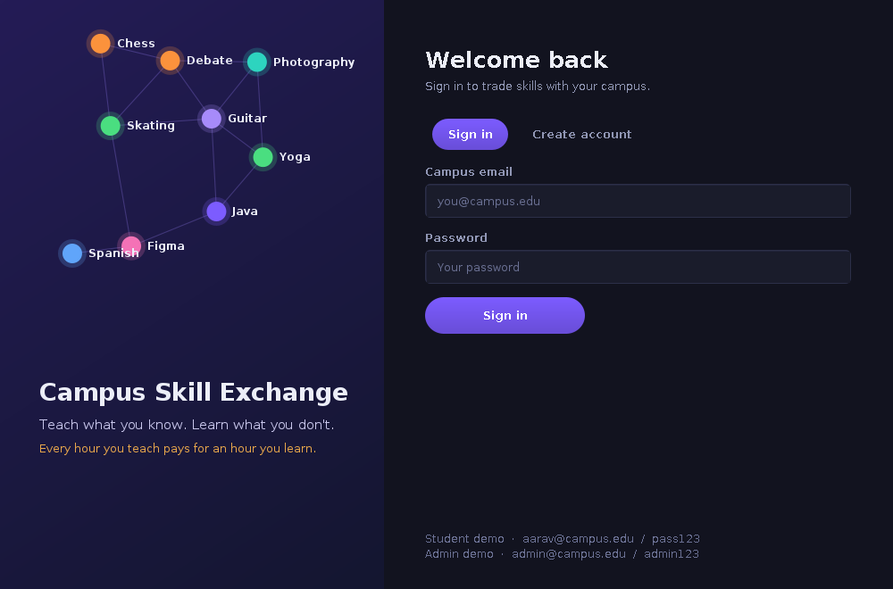
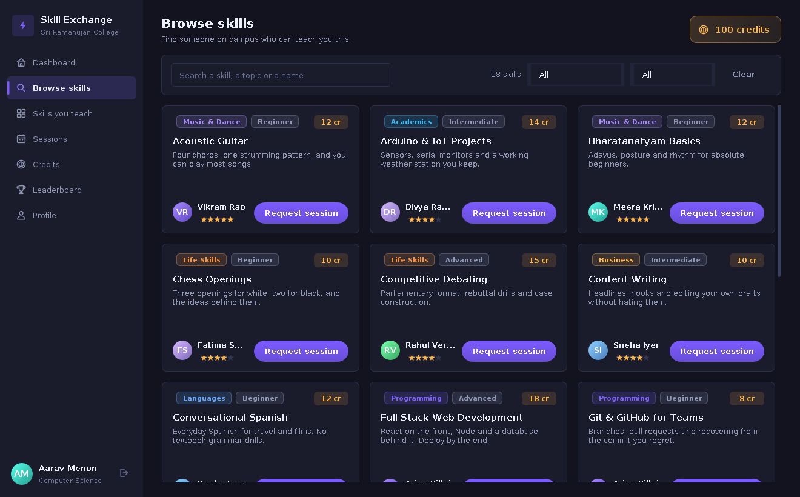
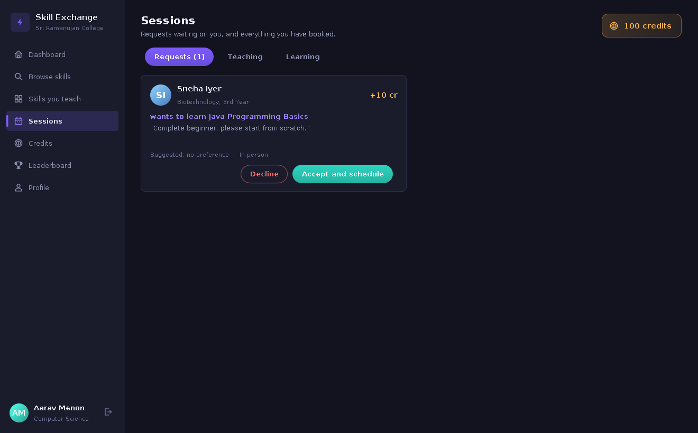
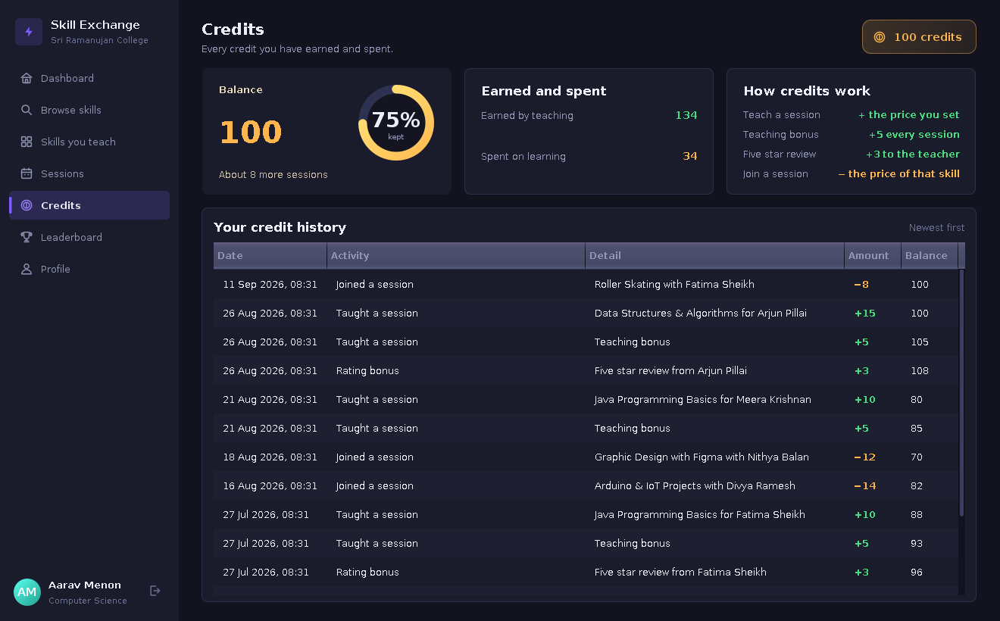
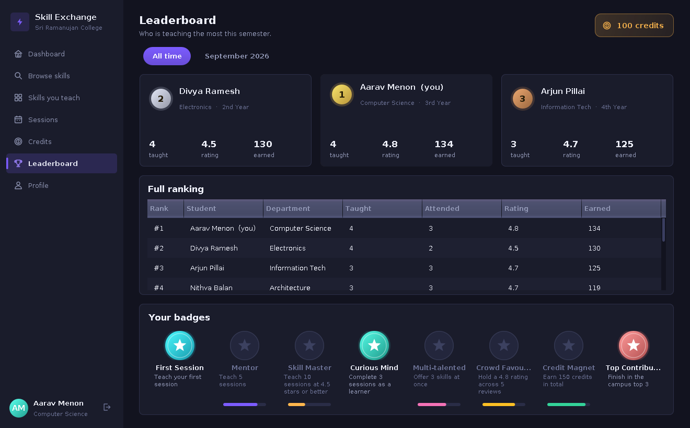
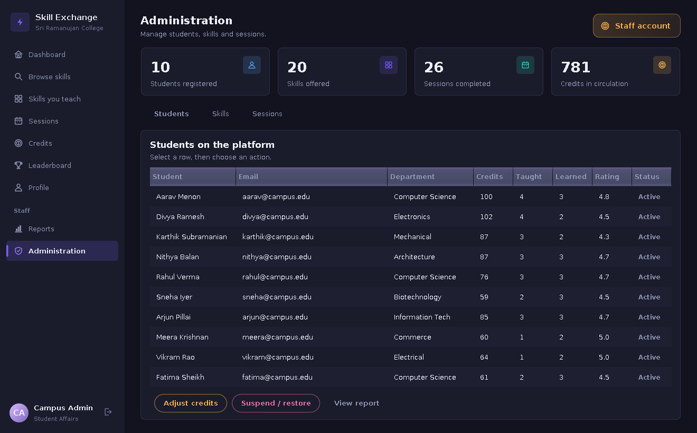

# Campus Skill Exchange & Credit System

A desktop application where students on a campus teach each other. Every hour you
teach earns credits, and those credits are what you spend to learn something from
someone else. No money changes hands, only time.

<div align="center">

# 🎓 Campus Skill Exchange & Credit System

**Teach what you know. Learn what you don't.**
**Every hour you teach pays for an hour you learn — no money, ever.**




</div>

## What this is

A desktop application that turns informal peer tutoring into a fair, trackable
economy. Students list the skills they can teach, request sessions from
classmates who can teach *them*, and every session moves credits instead of
cash — teach a session and you're paid in credits; learn one and you spend
them. Eight modules cover the full loop: accounts, skill listings, session
scheduling, the credit ledger, ratings, a campus leaderboard with badges,
admin reporting, and the storage layer underneath all of it.

Built entirely in **Java 21 + Swing** — no framework, no database server, no
build tool. Every chart, icon, avatar and the login-screen illustration is
hand-painted with `Graphics2D`; there isn't a single image asset in the repo.

---

## Quick start

```bash
git clone <this-repo-url>
cd CampusSkillExchange

# build and run
sh run.sh          # macOS / Linux
run.bat             # Windows
```

Or by hand:

```bash
javac -d out $(find src -name "*.java")
java -cp out Main
```

The first run seeds a demo campus — 11 accounts, 20 skills, 37 sessions and
the credit history behind them — into a `data/` folder next to the jar.
Delete `data/` to reset and reseed.

**Try it with:**

| Role | Email | Password |
|---|---|---|
| Student | `aarav@campus.edu` | `pass123` |
| Any other student | `divya@campus.edu`, `rahul@campus.edu`, `sneha@campus.edu` … | `pass123` |
| Administrator | `admin@campus.edu` | `admin123` |

A headless check that doesn't open a window:

```bash
java -cp out Main --selftest
```

---

## Screenshots

<table>
<tr>
<td width="50%"><br><sub>Sign in — the network graphic is hand-painted, not an image file</sub></td>
<td width="50%"><br><sub>Browse skills, with live search and filters</sub></td>
</tr>
<tr>
<td width="50%"><br><sub>Session requests waiting for a response</sub></td>
<td width="50%"><br><sub>The credit passbook — every earn and spend, with a running balance</sub></td>
</tr>
<tr>
<td width="50%"><br><sub>Campus leaderboard, podium and achievement badges</sub></td>
<td width="50%"><br><sub>Administrator console — students, skills and sessions</sub></td>
</tr>
</table>

---

## How the credit economy works

| Event | Credits |
|---|---|
| Joining the platform | **+60** welcome bonus |
| Teaching a session | **+**the price the teacher set (5–25) |
| Teaching bonus, every completed session | **+5** |
| Receiving a five-star review | **+3** |
| Attending a session | **−**the price of that skill |
| A scheduled session is cancelled | full refund to the learner |

A learner can never send a request they can't afford, and the charge only
happens when a session is actually marked complete — so nobody pays for a
session that never ran, and nobody can end up with a negative balance.

---

## Architecture

```
Swing UI  ──►  Service Layer  ──►  Domain Model  ──►  Database
(ui/)          (service/)          (model/)           (data/)

   login, dashboard,   every business    User, Skill,    in-memory lists,
   browse, sessions,   rule lives here   Session,        saved to
   credits, admin …    — the UI never    Transaction,    pipe-delimited
                   touches storage  Feedback        text files
                   directly
```

Only `Database.load()` / `Database.save()` know that persistence is a text
file — swapping in JDBC and a real database means rewriting those two
methods and nothing else.

| Module | Key classes | What it does |
|---|---|---|
| User management | `AuthService`, `LoginFrame`, `ProfilePanel` | Registration, sign-in, profile & password edits |
| Skill management | `SkillService`, `MySkillsPanel`, `BrowsePanel` | Add, edit, retire and search skills by category/level |
| Learning sessions | `SessionService`, `SessionsPanel` | Request → accept & schedule → complete / cancel |
| Credit system | `CreditService`, `CreditRules`, `CreditsPanel` | The ledger — every balance change, fully auditable |
| Feedback & rating | `FeedbackService` | Two-way star reviews, teacher & skill averages |
| Leaderboard & badges | `LeaderboardService`, `LeaderboardPanel` | All-time / monthly ranking, 8 achievement badges |
| Reports | `ReportService`, `ReportsPanel` | Activity, credit and popular-skill reports |
| Database | `Database`, `Seed` | Load/save every entity, seed a demo campus |

---

## Project structure

```
CampusSkillExchange/
├── src/
│   ├── Main.java              entry point + --selftest
│   ├── util/                  hashing, date helpers
│   ├── model/                 User, Skill, LearningSession, CreditTransaction, Feedback, Badge
│   ├── data/                  Database (file-backed store) + Seed
│   ├── service/               business rules — the only thing the UI ever calls
│   └── ui/                    every Swing screen, theme, icons, hand-painted charts
├── screenshots/                a look at every screen, for anyone not running it locally
├── run.sh / run.bat
└── README.md
```

---

## Why no database, no framework?

The whole point was demonstrating that a small, dependency-free Java program
can model and enforce a fair economy end to end — so the persistence layer
is intentionally a hand-written flat-file store rather than JDBC + MySQL. It's
kept behind one class specifically so that swap is a follow-up, not a
rewrite. See **Roadmap** below.

## Roadmap

- [ ] Swap the flat-file store for JDBC + MySQL/PostgreSQL
- [ ] Add a JUnit suite for the service layer
- [ ] Client–server mode for multiple students at once
- [ ] Email / in-app notifications for session requests
- [ ] A companion mobile app for browsing and requests

## License

MIT — see [LICENSE](LICENSE).

---

## Running it

```
javac -d out $(find src -name "*.java")     # compile
java -cp out Main                            # run
```

Or use the helper scripts:

* Linux / macOS: `sh run.sh`
* Windows: `run.bat`

A headless check of the service layer (no window opens):

```
java -cp out Main --selftest
```

The first run creates a `data/` folder and fills it with a demo campus:
11 accounts, 20 skills, 37 sessions and the credit history behind them.
Delete `data/` to start again from the seed.

### Demo logins

| Account | Email | Password |
|---|---|---|
| Student (top of the leaderboard) | `aarav@campus.edu` | `pass123` |
| Any other student | `divya@campus.edu`, `rahul@campus.edu`, … | `pass123` |
| Administrator | `admin@campus.edu` | `admin123` |

---

## The eight modules

| Module | Where it lives | What it does |
|---|---|---|
| User management | `service/AuthService`, `ui/LoginFrame`, `ui/ProfilePanel` | Registration, sign in, profile editing, password change |
| Skill management | `service/SkillService`, `ui/MySkillsPanel`, `ui/BrowsePanel` | Offer a skill, edit it, retire or re-offer it, search by text, category and level |
| Learning sessions | `service/SessionService`, `ui/SessionsPanel` | Request, accept with a date and venue, decline, cancel, mark complete |
| Credit system | `service/CreditService`, `service/CreditRules`, `ui/CreditsPanel` | Earning, spending, refunds and a full passbook of every movement |
| Feedback & rating | `service/FeedbackService` | Star reviews in both directions, teacher averages, per-skill ratings |
| Leaderboard & achievements | `service/LeaderboardService`, `ui/LeaderboardPanel` | All-time and monthly ranking, podium, eight unlockable badges |
| Reports | `service/ReportService`, `ui/ReportsPanel` | User activity, credit and popular-skill reports, saved to `reports/` |
| Database | `data/Database`, `data/Seed` | Loads and saves every entity, hands out ids, seeds a demo campus |

---

## How credits work

| Event | Credits |
|---|---|
| Joining the platform | **+60** welcome bonus |
| Teaching a session | **+** the price the teacher set (5 to 25) |
| Teaching bonus, every completed session | **+5** |
| Receiving a five star review | **+3** |
| Attending a session | **−** the price of that skill |
| A scheduled session is cancelled | full refund to the learner |

A learner cannot send a request they cannot afford, and the charge only happens
when the session is actually marked complete, so nobody pays for a session that
never happened.

## Badges

First Session, Mentor, Skill Master, Curious Mind, Multi-talented,
Crowd Favourite, Credit Magnet and Top Contributor. Badges are never stored —
they are recalculated from the records every time a page is opened, so they can
never drift out of step with reality.

---

## Design of the code

```
src/
  Main.java              entry point and --selftest
  util/Util              hashing, date handling, small helpers
  model/                 User, Skill, LearningSession, CreditTransaction, Feedback, Badge
  data/Database          in-memory lists backed by pipe-delimited text files
  data/Seed              the demo campus
  service/               all the rules: auth, skills, sessions, credits, feedback,
                         leaderboard, reports
  ui/                    Swing screens, the theme and the hand-painted charts
```

Three points worth making in a viva:

1. **The UI never touches the rules.** Panels call services; services validate and
   then write to the database. Anything a user could reasonably get wrong is
   raised as `AuthService.RuleException` and shown as a readable message.
2. **Storage is isolated.** Only `Database.load()` and `Database.save()` know that
   persistence is a text file. Swapping in JDBC means rewriting those two methods
   and nothing else. The file format is one record per line with `|` separators;
   the separator is stripped from user input on the way in.
3. **Nothing is drawn from an image file.** The ring gauge, bar and column charts,
   badges, avatars, medals, icons and the login artwork are all painted with
   `Graphics2D`, so the project is a single self-contained source tree.

### Credit integrity

Every change to a balance goes through `CreditService.grant`, which writes a
`CreditTransaction` recording the amount and the balance immediately after.
The passbook therefore reconstructs any balance at any point in time, and the
self test verifies no account can go negative.

---

## Screenshots

See the `screenshots/` folder: login, dashboard, browse, my skills, sessions,
credits, leaderboard, profile and the two administrator pages.
